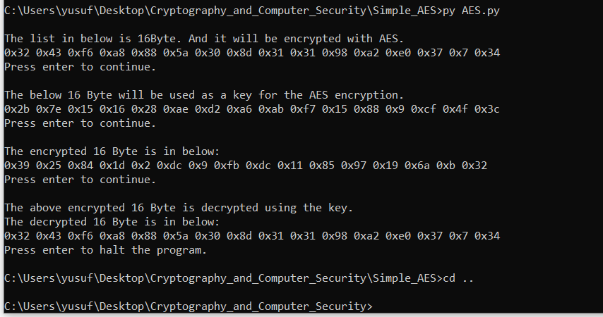

# AES-Advanced-Encryption-Standard
* This program is an assignment of Cryptography and Computer Security course.
* This is a simple 128 bit AES implemantaion with python.
* This program encrypt 128bit data with given 128bit key.
* For more information about AES: https://en.wikipedia.org/wiki/Advanced_Encryption_Standard    
* This program could not encrypt more than 128 bit data. For encrypting more than 128 bit data modes of operation should be used.
* For more information about modes of operation: https://en.wikipedia.org/wiki/Block_cipher_mode_of_operation    

* For implementinf AES I used [this](fips-197.pdf) documention.
* From line 390 in AES.py you can change input data.
* From line 391 in AES.py you can change key value.

